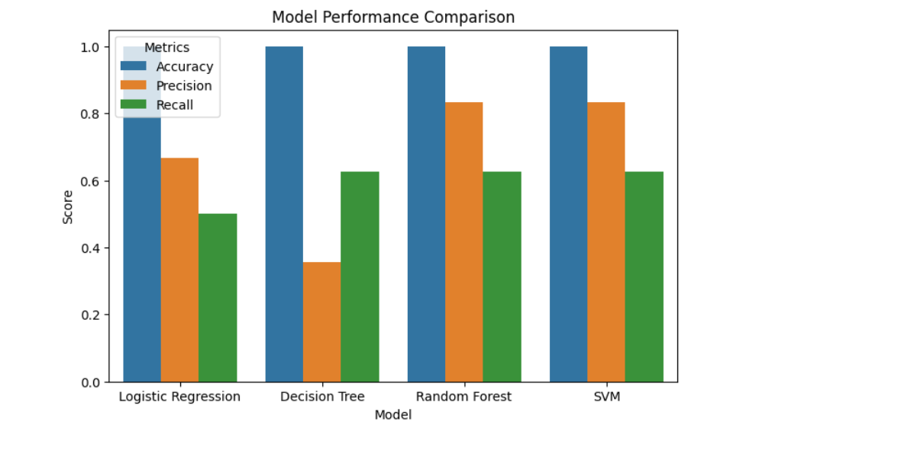

# 💳 Fraud Detection using Machine Learning
### Comparative Study of Classification Models

---

## 📊 Project Preview

---

## 🚀 Overview

This project builds a machine learning system to detect fraudulent financial transactions using multiple classification models.

---

## 📌 Problem Statement
Detect fraudulent transactions using machine learning.

---

## 🧠 Approach
- Data preprocessing
- Model training (4 models)
- Evaluation using precision, recall
- Visualization

---

## 📊 Results
Random Forest and SVM performed best.

---

## 📈 Visualizations

* Confusion Matrix
* Model Comparison Chart
* Feature Importance
* ROC Curve
* Pairplot

---

## 🧠 Key Insight

Precision and recall are more important than accuracy in imbalanced datasets.

---

## 🔮 Future Improvements
- SMOTE
- Hyperparameter tuning
- Deployment

---

## 🛠️ Tech Stack

Python • Pandas • Scikit-learn • Matplotlib • Seaborn

---
